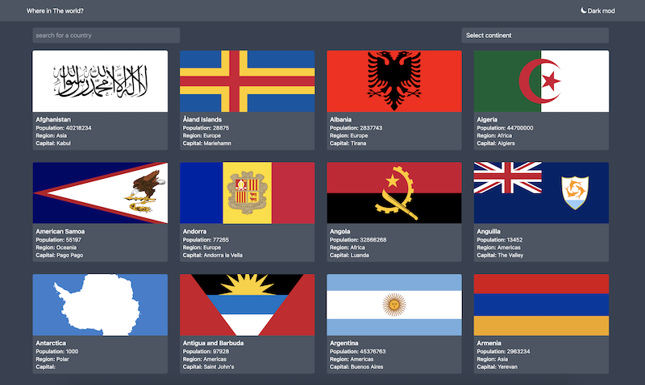

# Countries App

## About

This project is an example SPA written in React that shows a list of countries with their details using a public REST API. When a country is clicked, the country's detail will be shown. It is possible to search and filter by name or continent. It is possible to toggle between the dark mode and the light mode.

The project uses a public REST API at this address: https://restcountries.com/v2




For more images click [here](./docs/demo.md)
## Prerequisites
- Install [NodeJs](https://nodejs.org/en/download/)
- Install [NPM](https://docs.npmjs.com/downloading-and-installing-node-js-and-npm)

## Getting started
Install all the packages and run the project using the below commands:

```bash
# Install packages
npm install

# Start the project
npm start
```

The last command runs the app in the development mode. Now, open [http://localhost:3000](http://localhost:3000) to view it in your browser.

### Dependencies added
- `tailwindcss`
- `axios`
- `local-storage`


